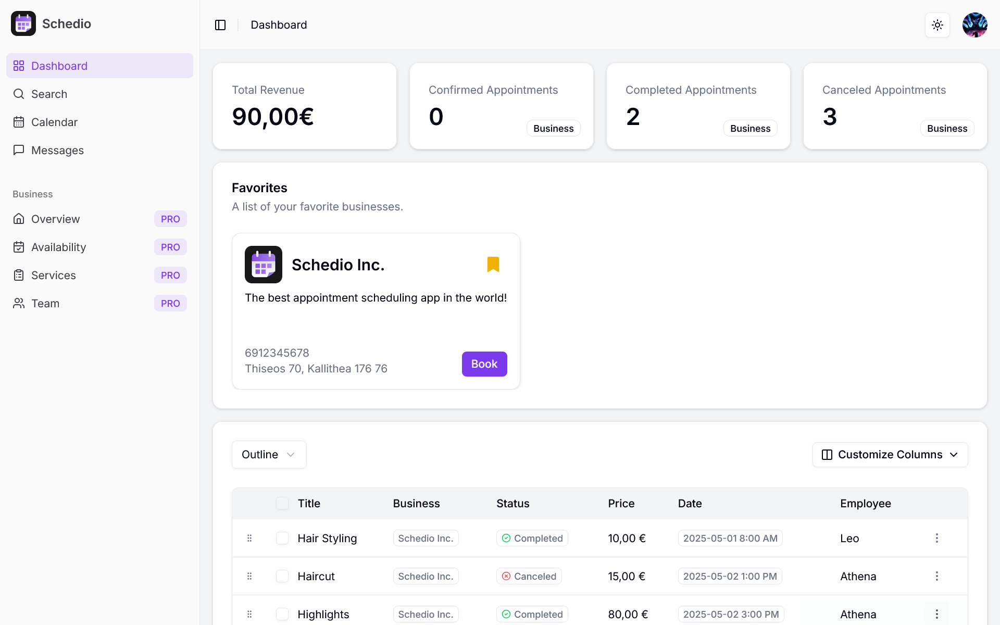

# Schedio – Appointment Scheduling Platform

Schedio is a full-featured appointment scheduling platform that allows users to seamlessly book appointments with businesses. It supports online payments, calendar integration, and built-in chat functionality, making it a modern solution for both customers and service providers.

**Live Demo:** [schediobooking.com](https://schediobooking.com)

## Features

### For Users (Free Plan)

- **Book Appointments**: Schedule appointments with businesses using an intuitive booking form.
- **Online Payments**: Pay securely online via Stripe.
- **Email Notifications**: Receive instant email confirmations when booking an appointment.
- **Calendar Integration**: View appointments in both the in-app calendar and external calendars (Google or Microsoft).
- **Favorites**: Add businesses to a personal favorites list for quick access.
- **Appointment Management**: Cancel appointments and receive refunds automatically.
- **Chat Support**: Engage in real-time conversations with businesses through the built-in chat feature.

### For Businesses (Pro Plan – 49€/month)

Everything users can do, plus:

- **Business Registration**: Create and manage a detailed business profile.
- **Service & Staff Management**: Add services and assign employees to them.
- **Working Hours**: Define and customize weekly availability for appointments.
- **Dashboard Analytics**:
  - Total revenue
  - Number of confirmed, completed, and cancelled appointments
- **Subscription Control**: Cancel or renew the Pro Plan subscription at any time.

---

## Tech Stack

- **Framework**: [Next.js](https://nextjs.org/)
- **Language**: [TypeScript](https://www.typescriptlang.org/)
- **Styling**: [Tailwind CSS](https://tailwindcss.com/)
- **UI Components**: [shadcn/ui](https://ui.shadcn.com/)
- **Authentication**: [Auth.js](https://authjs.dev/)
- **Database**: [Supabase](https://supabase.com/)
- **Payments**: [Stripe](https://stripe.com/)
- **Emails**: [Resend](https://resend.com/)
- **File Uploads**: [UploadThing](https://uploadthing.com/)
- **Calendar Sync**: [Nylas](https://www.nylas.com/)
- **Deployment**: [Vercel](https://vercel.com/)

---

## Screenshots

## 

## Installation & Development

> Note: This project is deployed and actively maintained. For local development:

```bash
# 1. Clone the repository
git clone https://github.com/andreasrous/appointment-app.git
cd appointment-app

# 2. Install dependencies
npm install

# 3. Set up environment variables
cp .env.example .env
# Fill in values for Supabase, Stripe, Resend, Nylas, etc.

# 4. Run the development server
npm run dev
```

## Author

**Andreas Rousounelos**  
GitHub: [@andreasrous](https://github.com/andreasrous)
